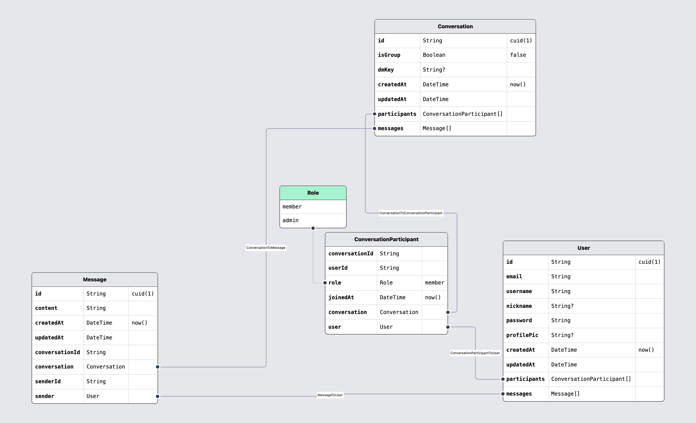

## Database Schema



## Development Setup

Clone the repo and install dependencies at the root:

```bash
git clone https://github.com/Simonmon06/chat-app.git
cd chat-app
pnpm install
```

Generate Prisma client (shared across packages):

```bash
pnpm run prisma generate
```

Run all apps in parallel:

```bash
pnpm run dev:server   # Express + Prisma + PostgreSQL
pnpm run dev:client   # React + Vite frontend
pnpm run dev:packages # shared Zod/validator package (watch mode)
```

🎥 Demo

- Live App: https://chat-app-client-y25q.onrender.com

## ⚠️ Notes on Deployment

- The app is hosted on **Render free tier**, which has a **cold start time of ~50 seconds**.
- If the demo link seems unresponsive at first, please wait up to a minute for the server to wake up.
- Once active, the app runs normally with real-time messaging.
